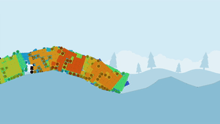

# Vehicle Evolver Deluxe

[](https://ko-fi.com/W7W2X7WN)



This is a simulation that uses AI (to be specific: [genetic algorithms](https://en.wikipedia.org/wiki/Genetic_algorithm)) to try to build better and better vehicles. The vehicles have to overcome an obstacle course, starting with some slight hills, followed by steeper hills, and finally some jumps. The vehicles are made out of panels and wheels, connected together, similar to the game [Besiege](https://store.steampowered.com/app/346010/Besiege/), except in 2D.

[Try the live web demo here.](https://bauxitedev.github.io/vehicle_evolver_deluxe/index.html) (needs a fast computer, on mobile browsers it'll run really slow, although Fennec seems faster than Chrome)

[I made an in-depth video explaining how it works here](https://www.youtube.com/watch?v=DlRNdCCSSyo). See the section below for a short summary.

## Genetic algorithms

A quick rundown of how it works:

1. The population of vehicles is initially randomly generated.
2. The simulation is run on all vehicles. The further a vehicle makes it through the obstacle course, the higher its fitness gets. If the vehicle doesn't leave the starting area, it gets a fitness of 0. If the vehicle makes it all the way to the finish line, its fitness will be about 14 thousand.  If the vehicle falls apart, its fitness is divided by 10, to punish it; vehicles should try to remain intact. Additionally, a timer is set, so vehicles only have a set amount of time to reach the finish line.
3. The vehicles are run through a process of crossover and mutation, with fitter vehicles having a higher chance of being used as parents. The program uses [tournament selection](https://en.wikipedia.org/wiki/Tournament_selection) to select the parents, and [one-point crossover](https://en.wikipedia.org/wiki/Crossover_(genetic_algorithm)#One-point_crossover) to produce offspring from two parents (that means, given two parent vehicles A and B, the left-hand side of A is smashed together with the right-hand side of B, and vice versa, to create two new vehicles). Additionally, blocks are mutated uniformly (that means blocks are randomly picked and changed to either air, panel, or wheel). The result is a new population of vehicles, entering a new generation.
4. Go to step 2. Repeat ad infinitum.

Ideally, after repeating these steps often enough, the fitness of the population should increase, and many vehicles should make it to the finish line. Although, due to the low population size, good solutions may not always be found. And, due to non-determinism (see Known Issues), the fitness may actually decrease over time.

## Compiling from source

This program uses Rust, so ensure you have `rustup` and `cargo` installed, and [cargo-make](https://github.com/sagiegurari/cargo-make) to allow for easy compilation to both native and WASM targets, so ensure you have that installed too. Also, if you want to build the web version, ensure you have the WASM target installed: `rustup target add wasm32-unknown-unknown`.

To run natively:

```bash
cargo make run -p release
```

To run for web: (connect to `localhost:4000` in your browser after it's done compiling)

```bash
cargo make serve -p release
```

## Known issues

- The simulation is non-deterministic, which means the same vehicle can have different fitness scores when run multiple times. I'm not sure if this is an issue with my code or with [bevy_rapier2d](https://github.com/dimforge/bevy_rapier/issues/79) in general.
- Due to small population sizes, the simulation may never find a good solution and get stuck in a local minimum. A larger population size is not feasible at the moment due to performance limitations.

## License

MIT for now, although the program is based on [bevy_webgl2_app_template](https://github.com/mrk-its/bevy_webgl2_app_template), which doesn't have a license yet... so keep that in mind.
